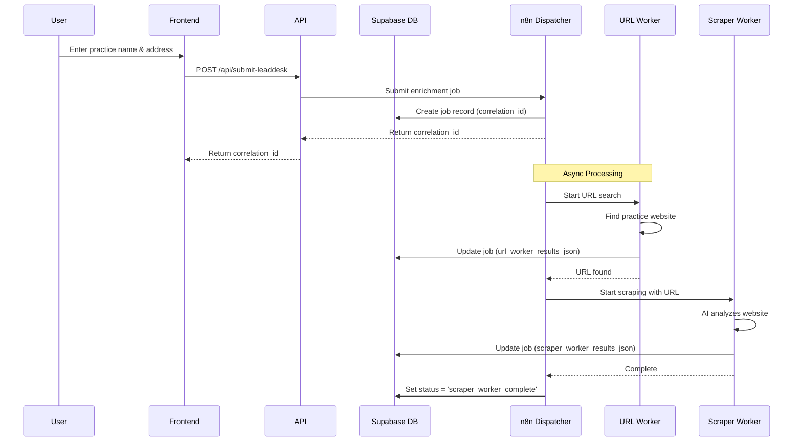
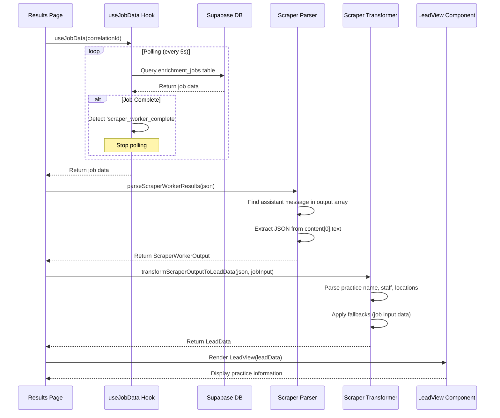

# n8n to Frontend Data Flow

This document visualizes how lead data flows from n8n automation to the frontend LeadView component.

## High-Level Architecture

```
┌─────────────┐      ┌─────────────┐      ┌──────────────┐      ┌─────────────┐
│   Frontend  │─────▶│   API Route │─────▶│  Supabase DB │◀─────│     n8n     │
│   (Search)  │      │  /submit    │      │              │      │  Dispatcher │
└─────────────┘      └─────────────┘      └──────────────┘      └─────────────┘
                                                  │                      │
                                                  │                      ▼
                                                  │              ┌─────────────┐
                                                  │              │ URL Worker  │
                                                  │              └─────────────┘
                                                  │                      │
                                                  │                      ▼
                                                  │              ┌─────────────┐
                                                  │              │   Scraper   │
                                                  │              │   Worker    │
                                                  │              └─────────────┘
                                                  │                      │
                                                  │                      ▼
                                                  │              (Updates DB with
                                                  │               results JSON)
                                                  │
                                                  ▼
┌─────────────┐      ┌─────────────┐      ┌──────────────┐
│  LeadView   │◀─────│  Transform  │◀─────│  useJobData  │
│  Component  │      │   Pipeline  │      │     Hook     │
└─────────────┘      └─────────────┘      └──────────────┘
```

## Detailed Data Flow

### Phase 1: Job Submission & Processing



### Phase 2: Frontend Data Retrieval & Display



## Database Schema: enrichment_jobs Table

```
┌────────────────────────────────────────────────────────────────┐
│                      enrichment_jobs                           │
├────────────────────────────────────────────────────────────────┤
│ correlation_id              │ UUID (Primary Key)               │
│ run_user_id                 │ UUID (User who submitted)        │
│ created_at                  │ Timestamp                        │
│ overall_job_status          │ Text (job state)                 │
│ input_customer_name         │ Text (user input)                │
│ input_street_address        │ Text (user input)                │
│ input_city                  │ Text (user input)                │
│ input_state                 │ Text (user input)                │
│ url_worker_job_id           │ Text (n8n worker ID)             │
│ url_worker_results_json     │ JSONB (URL search results)       │
│ url_worker_resulting_url    │ Text (found URL)                 │
│ scraper_worker_job_id       │ Text (n8n worker ID)             │
│ scraper_worker_results_json │ JSONB (AI scraper results) ⭐    │
└────────────────────────────────────────────────────────────────┘

⭐ Key field containing all practice data
```

## Data Parsing Pipeline

### 1. Raw AI Response Structure

```json
{
  "output": [
    {
      "id": "web_search_...",
      "type": "web_search_call",
      "status": "completed"
    },
    {
      "id": "reasoning_...",
      "type": "reasoning",
      "summary": ["..."]
    },
    {
      "id": "msg_...",
      "role": "assistant",
      "type": "message",
      "status": "completed",
      "content": [
        {
          "text": "{\"practice_name\": \"Florence Modern Dentistry\", ...}",
          "type": "output_text"
        }
      ]
    }
  ]
}
```

### 2. Scraper Parser (`utils/scraper-parser.ts`)

**Purpose:** Extract practice data from AI response format

**Strategy 2 (Current):**
```javascript
// Find the assistant message in output array
const messageItem = scraperWorkerResultsJson.output.find(
  (item) => item.type === 'message' && item.role === 'assistant'
)

// Extract JSON text from content
const textContent = messageItem.content[0].text
return JSON.parse(textContent) // Returns ScraperWorkerOutput
```

**Output Format:** `ScraperWorkerOutput`
```typescript
{
  practice_name: string
  resulting_url: string
  person_in_charge: {
    name: string
    role: string
    credentials?: string
  }
  staff_list: Array<{
    name: string
    role: string
    credentials?: string
  }>
  locations?: Array<{
    name: string
    address: string
    phone?: string
    state?: string
    staff_at_location?: Array<...>
  }>
  works_multiple_locations: boolean
  scrape_notes?: string
  practice_specialties?: string[]
}
```

### 3. Scraper Transformer (`utils/scraper-transformer.ts`)

**Purpose:** Convert `ScraperWorkerOutput` to `LeadData` format with fallbacks

**Transformation Logic:**
```typescript
1. Parse scraper output using parser
2. Count dentists and hygienists from staff_list
3. Transform locations array with proper structure
4. Build staff list (person_in_charge + staff_list + location staff)
5. Apply fallback cascade:
   - Practice Name: scraped → input_customer_name → "Unknown Practice"
   - Address: locations[0] → input_address → "Address not available"
6. Return LeadData object
```

**Output Format:** `LeadData`
```typescript
{
  practiceName: string
  practiceAddress: string
  practiceWebsite?: string
  practicePhone?: string
  practiceEmail?: string
  practiceSpecialty: string
  numberOfDentists: number
  numberOfHygienists: number
  staff: StaffMember[]
  locations: Location[]
  specialties: string[]
  
  // Scraper metadata
  resultingUrl?: string
  personInCharge?: {...}
  worksMultipleLocations?: boolean
  scrapeNotes?: string
}
```

### 4. LeadView Component (`components/lead-view.tsx`)

**Purpose:** Display enriched practice data in organized UI

**Features:**
- **Overview Tab:** Summary cards, practice info, scraper metadata
- **Locations Tab:** Table of all office locations
- **Staff Tab:** Complete staff directory with roles
- **Contact Tab:** Main contact information
- **Analytics Tab:** Role distribution charts

## Job Status Flow

```
┌─────────────────────┐
│  pending_url_search │
└──────────┬──────────┘
           │
           ▼
┌─────────────────────┐
│  url_worker_called  │
└──────────┬──────────┘
           │
           ▼
┌─────────────────────┐
│ url_worker_complete │
└──────────┬──────────┘
           │
           ▼
┌─────────────────────┐
│scraper_worker_called│
└──────────┬──────────┘
           │
           ▼
┌─────────────────────┐
│scraper_worker_      │  ← Frontend displays LeadView
│    complete ✓       │
└─────────────────────┘
```

## Key Files

### Backend/API
- **`app/api/submit-leaddesk/route.ts`** - Submits job to n8n dispatcher
- **`app/api/check-job-status/route.ts`** - Checks job status (legacy, not used in current flow)

### Frontend Hooks
- **`hooks/useJobData.ts`** - Polls database for job updates, returns job data

### Data Processing
- **`utils/scraper-parser.ts`** - Extracts practice data from AI response
- **`utils/scraper-transformer.ts`** - Transforms to LeadData format with fallbacks

### UI Components
- **`app/results/[id]/page.tsx`** - Results page, orchestrates data flow
- **`components/lead-view.tsx`** - Displays practice information

### Types
- **`types/database.types.ts`** - Database schema types (EnrichmentJob)
- **`components/lead-view.tsx`** - LeadData and related interfaces

## Error Handling & Fallbacks

### Parser Strategies (in order)
1. **Strategy 1:** Direct object with `practice_name` field
2. **Strategy 2:** Array format - find assistant message ⭐ (Current)
3. **Strategy 3:** Legacy Claude API format
4. **Strategy 4:** OpenAI string output
5. **Strategy 5:** OpenAI object output
6. **Strategy 6:** Stringified JSON

### Transformer Fallbacks
```
Practice Name:
  scraperOutput.practice_name
    ↓ (if null)
  jobInputData.input_customer_name
    ↓ (if null)
  "Unknown Practice"

Practice Address:
  locations[0].address (from scraper)
    ↓ (if null)
  input_street_address + input_city + input_state
    ↓ (if null)
  "Address not available"

Locations Array:
  scraperOutput.locations (parsed and transformed)
    ↓ (if empty && jobInputData exists)
  Create location from job input data
    ↓ (if still empty)
  [] (empty array)
```

## Polling Mechanism

The `useJobData` hook implements smart polling:

```typescript
// Initial fetch on mount
fetchJob()

// Poll every 5 seconds
const interval = setInterval(() => fetchJob(), 5000)

// Stop polling when job reaches terminal state
if (['scraper_worker_complete', 'failed', 'expired', 'cancelled'].includes(status)) {
  clearInterval(interval)
}
```

## Recent Bug Fix: "Unknown Practice" Issue

**Problem:** Practice displayed as "Unknown Practice" despite data existing in database

**Root Cause:** Parser was checking `output[0]` but data was in later array item

**Solution:** 
- Updated Strategy 2 to search entire `output` array
- Find item with `type: "message"` and `role: "assistant"`
- Extract practice data from that specific item

**Files Modified:**
- `utils/scraper-parser.ts` - Fixed array search logic
- `utils/scraper-transformer.ts` - Added job input fallbacks
- `app/api/check-job-status/route.ts` - Include input fields in query
- `app/results/[id]/page.tsx` - Pass job input to transformer

